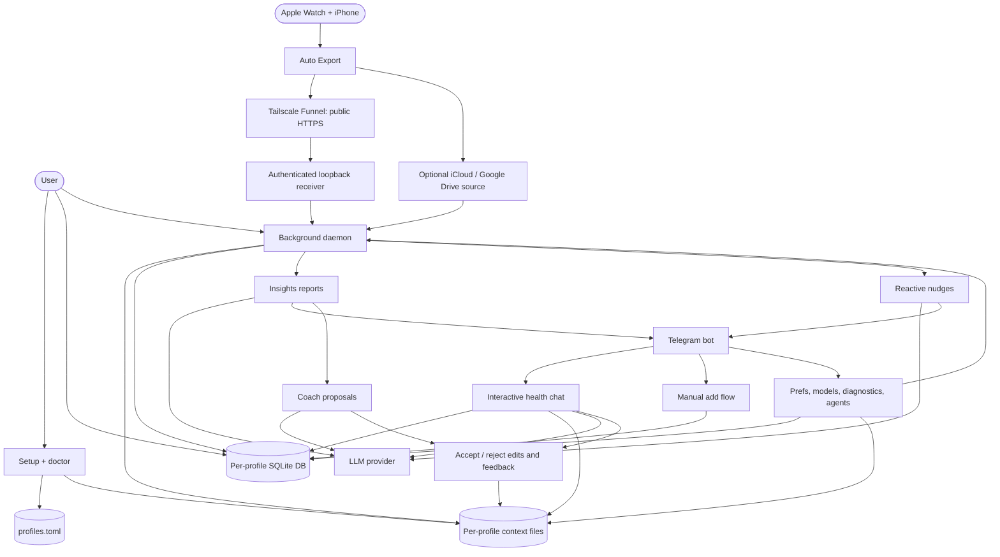
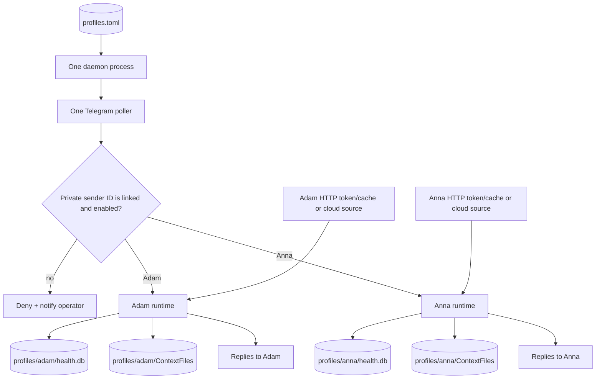
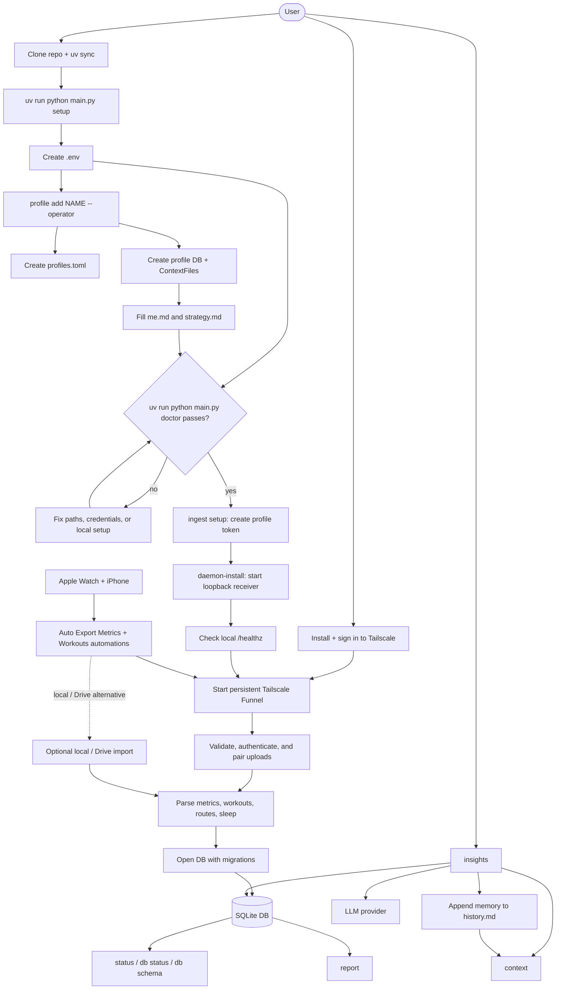
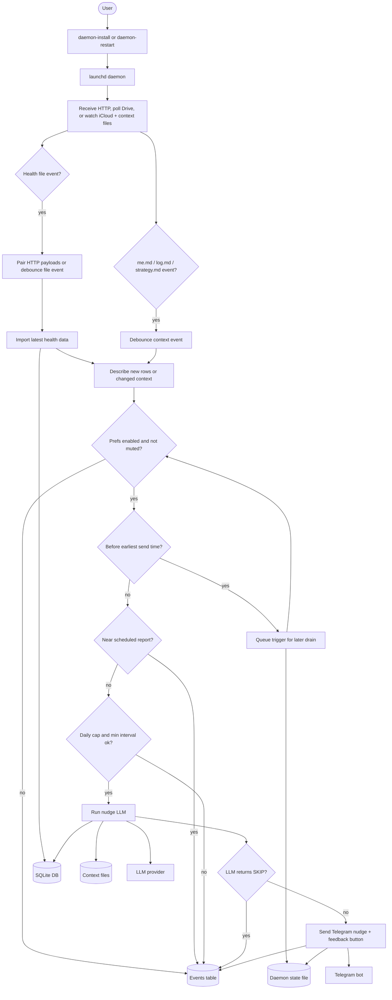
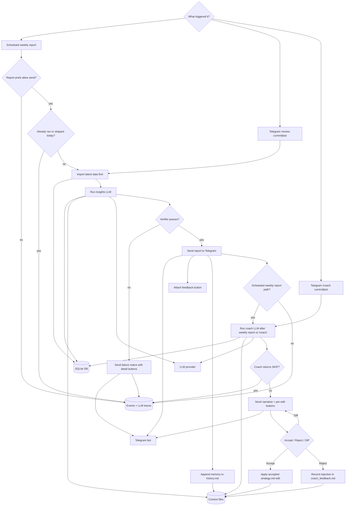
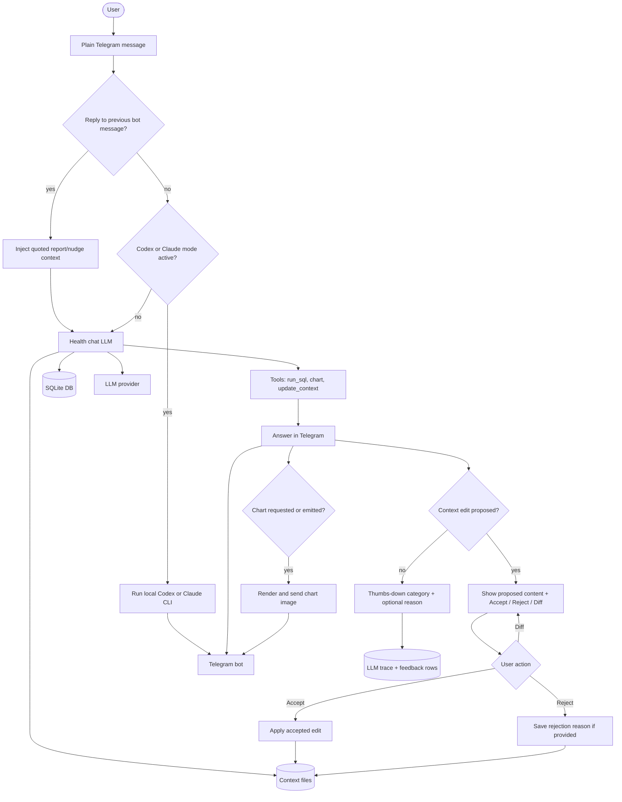
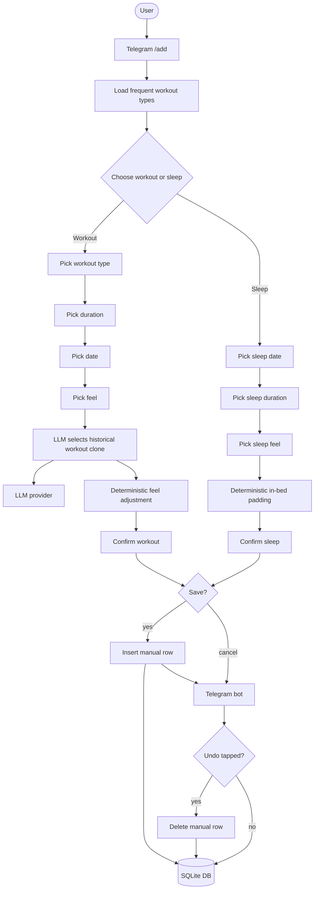
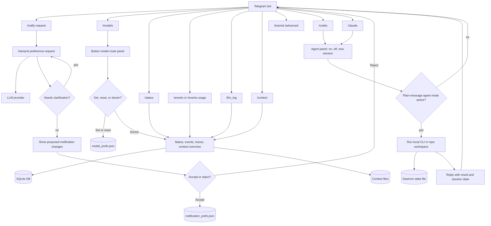

# User Flow Diagrams

## Overview

## Profile Routing And Isolation

No profile identity is stored in health rows. The selected database file and
profile directory are the isolation boundary.

## Setup And Data Import

## Daemon Notifications

## Reports And Coaching

## Telegram Chat And Context Edits

## Manual Add Flow

## Controls, Diagnostics, And Agent Mode

